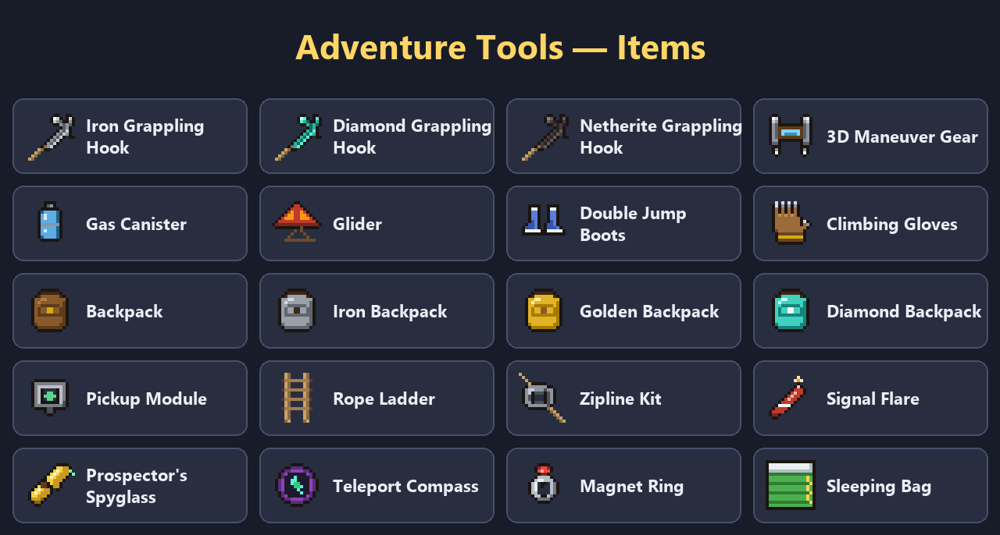

# Macera Aletleri – Adventure Tools

**English** | [Türkçe](README.tr.md)

A Minecraft mod full of tools that make exploring and moving around more fun: grappling hooks, Attack on Titan style
3D maneuver gear, gliders that ride campfire updrafts, double jump boots, wearable backpacks, rope ladders, ziplines,
signal flares, a prospector's spyglass and more.

| | |
|---|---|
| **Minecraft** | 26.2 |
| **Mod loader** | NeoForge 26.2.0.88 or newer |
| **Mod version** | 0.3.0 |
| **Required on** | Client **and** server (on multiplayer both sides need it) |
| **Optional** | [Curios](https://modrinth.com/mod/curios) – wear the magnet ring, gloves and glider in accessory slots |
| **License** | MIT |



---

## Contents

- [Installation](#installation)
- [Keys](#keys)
- [Tools](#tools)
- [Recipes](#recipes)
- [Enchantments, repair and durability](#enchantments-repair-and-durability)
- [Finding tools in the world](#finding-tools-in-the-world)
- [Advancements](#advancements)
- [Configuration](#configuration)
- [Curios support](#curios-support)
- [FAQ](#faq)
- [For developers](#for-developers)

---

## Installation

### Official Minecraft Launcher

1. **Install NeoForge**
   - Download the NeoForge installer for Minecraft **26.2** from [neoforged.net](https://neoforged.net).
   - Run the downloaded `.jar`, keep **Install client** selected and click **OK**.
   - Open the Minecraft Launcher; a **NeoForge** profile appears in the version list.
   - Start the game once with that profile and close it, so the `mods` folder is created.
2. **Add the mod**
   - Press `Win + R`, type `%appdata%\.minecraft\mods` and press **Enter**.
   - Copy `maceraaletleri-0.3.0.jar` into that folder.
3. **Play:** pick the **NeoForge** profile and press **Play**. If "Macera Aletleri" shows up in the **Mods** list on the main menu, you're done.

> Running the NeoForge installer requires Java. If the file doesn't open, install Java 25 from [adoptium.net](https://adoptium.net).

### CurseForge App / Modrinth App / Prism Launcher

1. Create a new profile (instance): **Minecraft 26.2**, loader **NeoForge**.
2. Search for the mod and add it, or copy the jar into the profile's **mods** folder.
3. Launch the profile.

### Server

1. Install NeoForge 26.2 on the server (same installer, **Install server**).
2. Copy the jar into the server's `mods` folder.
3. **Every player** joining also needs the mod installed.

---

## Keys

| Key | Action |
|---|---|
| **M** | Toggle the magnet ring |
| **B** | Open the backpack worn on your back |

Rebind them in Options → Controls → **Adventure Tools**.

**Tip:** hover any tool in your inventory and hold **Shift** to see how it's used.
You also get an **Adventure Guide** book the first time you join a world.

---

## Tools

All tools are in the **Adventure Tools** tab of the creative inventory.

### 🪝 Grappling Hook (Iron / Diamond / Netherite)

| To… | Do this |
|---|---|
| Throw / retract | **Right-click** |
| Pull yourself | Hook a **block** |
| Swing | Hold **Shift** while hooked to a block |
| Climb up / down the rope | **Space** / **S** while swinging |
| Pull a mob or item | Hook a **mob**, animal or **dropped item** |

No fall damage while you're being pulled.

| Hook | Range | Pull speed | Durability | Special |
|---|---|---|---|---|
| **Iron** | 30 blocks | Slow | 128 throws | – |
| **Diamond** | 45 blocks | Medium | 512 throws | – |
| **Netherite** | 60 blocks | Fast | 1024 throws | Fire and lava proof |

### ⚔️ 3D Maneuver Gear

Two-hook movement gear, Attack on Titan style. Hold it in your main hand:
- **Left click:** left hook. **Right click:** right hook. Press the same button again to retract that hook.
- Attached hooks **accelerate** you toward them; with both hooks out you sling between them.
- **Space:** gas boost in the direction you're looking.
- Hooks and boosts use **gas**. The blue bar under the item shows what's left (tank: 1000).
- When the tank runs dry, a **Gas Canister** from your inventory is loaded automatically.

### 🪂 Glider

Hold it and it opens **as soon as you start falling**; you glide where you look.
- It shows above your head while open (other players see it too).
- Fly over a **lit campfire** (or fire) and the **hot air lifts you up**.
- **Shift** closes it. No fall damage while gliding.

### 👢 Double Jump Boots

Wear them on your feet. Press jump **again** in mid-air for a second jump. Fall damage is also **halved**.

### 🎒 Backpacks

| Backpack | Slots | How to get |
|---|---|---|
| Backpack | 27 | Recipe |
| Iron Backpack | 36 | Backpack + iron block |
| Golden Backpack | 45 | Iron backpack + gold block |
| Diamond Backpack | 54 | Golden backpack + diamond block |

- **Right-click:** open. **Shift + right-click:** wear it on your back (chest slot). While worn it shows on your back and opens with **B**.
- Contents travel with the item and are kept when you upgrade.
- **Pickup Module:** drop the module onto a backpack in your inventory. From then on, items of a kind already in the backpack go straight into it when picked up.
- A backpack can't be put inside another backpack.

### 🪜 Rope Ladder

Right-click the side of a wall or the **top of a block at a cliff edge**. The ladder unrolls downward until it reaches the ground (max 24 blocks).
Breaking any piece, or **Shift + right-click**, picks up the whole ladder and gives you 1 rope ladder back.

### 🚡 Zipline Kit

1. **Right-click** a block: start point selected.
2. **Right-click** another block: the line is strung (max 48 blocks).
3. **Right-click either end** of the line to ride to the other end.

**Hit** an end to take the line down; the kit drops back.

### 🔥 Signal Flare

**Right-click** to throw. Where it lands it lights the area for **1 minute** and puffs **red smoke** visible from far away.
Great for lighting up caves or showing friends where you are.

### 🧲 Magnet Ring

While it's in your inventory and **turned on**, it pulls nearby items and experience orbs (8 blocks).
Toggle with **right-click** or **M**. Hold **Shift** to pause it.

### 🧭 Teleport Compass

**Shift + right-click:** save your location. **Right-click:** teleport there (30 s cooldown).

### 🔭 Prospector's Spyglass

**Right-click:** nearby ores (12 blocks) **glow through walls for 10 seconds**, each in its own color.

### 🧤 Climbing Gloves

Hold them and **walk into a wall** to climb. **Shift:** cling. No key: slide down slowly.

### 🛏️ Sleeping Bag

Place it and **right-click** at night to sleep. The night is skipped but **your spawn point doesn't change**. Made for long trips.

### 💀 Death Compass

When you die, it appears in your inventory after you respawn. Its needle points to where you dropped your items.
While held it shows the distance; it disappears once you get there. (Not given when `keepInventory` is on.)

---

## Recipes

All recipes show up in the in-game **recipe book** (unlocked when you pick up a key ingredient) and in JEI / EMI if installed.

| Tool | Recipe |
|---|---|
| **Iron Grappling Hook** |  |
| **Diamond Grappling Hook** |  |
| **Netherite Grappling Hook** (smithing table) |  |
| **3D Maneuver Gear** |  |
| **Gas Canister** (×2) |  |
| **Glider** |  |
| **Double Jump Boots** |  |
| **Climbing Gloves** |  |
| **Backpack** |  |
| **Iron Backpack** |  |
| **Golden Backpack** |  |
| **Diamond Backpack** |  |
| **Pickup Module** |  |
| **Rope Ladder** |  |
| **Zipline Kit** |  |
| **Signal Flare** (×4) |  |
| **Prospector's Spyglass** |  |
| **Teleport Compass** |  |
| **Magnet Ring** |  |
| **Sleeping Bag** (any wool) |  |

The backpack recipe accepts any wooden chest; backpack upgrades are shapeless.

---

## Enchantments, repair and durability

### New enchantments

Found at the enchanting table, in books and in villager trades:

| Enchantment | For | Effect |
|---|---|---|
| **Reach** I–III | Grappling hooks | +20% rope length per level |
| **Quick Pull** I–III | Grappling hooks | +15% pull speed per level |
| **Soaring** I–II | Glider | Slower fall, faster gliding |
| **Attraction** I–III | Magnet ring | +3 blocks pull radius per level |

Tools with durability also accept **Unbreaking** and **Mending**; the boots accept armor enchantments such as **Feather Falling**.

### Anvil repair

| Tool | Repair material |
|---|---|
| Iron / Diamond / Netherite Hook | Iron ingot / diamond / netherite ingot |
| Glider | Leather |
| Double Jump Boots | Phantom membrane |
| Teleport Compass | Ender pearl |
| Prospector's Spyglass | Gold ingot |

---

## Finding tools in the world

- **Structure chests:** dungeons, mineshafts, desert and jungle temples, ruined portals, shipwrecks, pillager outposts, woodland mansions, strongholds, ancient cities, igloos and buried treasure can contain the mod's tools.
- **Wandering trader:** may sell hooks, gliders, rope ladders, signal flares, sleeping bags, double jump boots and gas canisters for emeralds.

---

## Advancements

The advancements screen (**L**) has an **Adventure Tools** tab:

| Advancement | How to get it |
|---|---|
| Hang On! | Obtain a grappling hook |
| Lavaproof | Obtain a netherite grappling hook |
| Tarzan | Swing on a hook for 15 seconds without stopping |
| Get Over Here! | Pull a mob to you with a hook |
| Titan Slayer | Attach both hooks of the 3D maneuver gear at once |
| Free as a Bird | Glide for 10 seconds |
| Hot Air | Ride a campfire updraft with a glider |
| Gravity Who? | Jump again in mid-air |
| Wheee! | Ride a zipline to the end |
| Treasure Hunter | Find diamonds with the prospector's spyglass |

---

## Configuration

Server owners can tune values:
- **In game:** Mods → Macera Aletleri → **Config**
- **File:** `serverconfig/maceraaletleri-server.toml` in the world folder

| Setting | Default |
|---|---|
| Hook range / pull speed multiplier | 1.0 / 1.0 |
| Hooks can pull mobs and items | Yes |
| Glider max fall speed / forward speed | 0.08 / 0.4 |
| 3D maneuver pull acceleration / gas use per hook | 0.09 / 1 |
| Magnet radius | 8 blocks |
| Compass cooldown / cross-dimension teleport | 30 s / Yes |
| Spyglass search radius / glow time | 12 blocks / 10 s |
| Max zipline length | 48 blocks |
| Give death compass / guide book on first join | Yes / Yes |

Settings are synced from the server to players automatically.

---

## Curios support

With [Curios](https://modrinth.com/mod/curios) installed:
- **Magnet Ring** → ring slot (toggle with M)
- **Climbing Gloves** → hands slot
- **Glider** → back slot

Tools in accessory slots work as if held. Without Curios the mod works normally.

---

## FAQ

**The mod isn't in the Mods list.**
Make sure you launched the **NeoForge** profile and Minecraft is **26.2**. The jar must be directly inside `mods`, not in a subfolder.

**"Mod requires NeoForge …" error.**
Your NeoForge is too old; install 26.2.0.88 or newer.

**Can't join a server: "mismatched mod list".**
The mod has to be installed on both the server and your game, same version.

**The 3D maneuver gear doesn't fire.**
It must be in your **main hand**. If it's out of gas, carry a gas canister.

**The glider doesn't open.**
It only opens **while falling** (or rising over a campfire). It stays closed while you hold Shift and doesn't work together with an elytra.

**B doesn't open my backpack.**
B only opens a backpack **worn on your back**. Hold it and **Shift + right-click** to wear it.

**The magnet ignores some items.**
Items you just threw are ignored for a moment, otherwise they'd fly straight back.

**Reporting a bug.**
Open an issue with your `logs/latest.log` and the steps to reproduce.

---

## For developers

### Requirements

- **JDK 25.** Gradle tries to download it automatically; if that fails, install JDK 25 and add `org.gradle.java.installations.paths=...` to `~/.gradle/gradle.properties`.
- **8 GB of free memory.** The first build decompiles Minecraft (~7 GB RAM). Later builds skip this step.
- **IntelliJ IDEA** recommended: *File → Open* the project folder and select JDK 25 as the Gradle JVM.

### Commands

| Command | What it does |
|---|---|
| `./gradlew build` | Builds `build/libs/maceraaletleri-<version>.jar` |
| `./gradlew runClient` | Starts Minecraft with the mod (and Curios for testing); no account needed |
| `./gradlew runServer` | Starts a test server |
| `./gradlew runGameTestServer` | Starts a headless server, loads all data files and exits – handy for catching JSON errors |

### Project layout

```
src/main/java/com/ismail/maceraaletleri/
├── MaceraAletleri.java         Entry point, registration
├── Ayarlar.java                Server config
├── Basarimlar.java             Advancements granted from code
├── Buyuler.java                Enchantments (effects are applied in code)
├── ModItems / ModBlocks / ModEntities / ModMenus / ModDataComponents / ModCreativeTabs
├── item/                       Item classes
├── block/                      Rope ladder, sleeping bag
├── entity/                     Hook, zipline, signal flare
├── menu/                       Backpack menu
├── event/                      Glider, gloves, magnet, boots, server events
├── network/                    Client → server packets
├── compat/                     Curios integration (optional)
└── client/                     Renderers, player layer, backpack screen, keys, tooltips

src/main/resources/
├── assets/maceraaletleri/      Models, textures, lang files (en_us, tr_tr)
├── data/maceraaletleri/        Recipes, advancements, enchantments, loot, trades, tags
├── data/minecraft/             Vanilla tag additions
├── data/curios/                Curios slot tags
└── META-INF/accesstransformer.cfg
```

The code is written with Turkish identifiers and comments.

### Releasing a new version

1. Bump `mod_version` in `gradle.properties`.
2. Run `./gradlew build`.
3. Upload the jar from `build/libs/`.
4. Add an entry to [CHANGELOG.md](CHANGELOG.md).

---

## License

[MIT](LICENSE) © 2026 ismail
