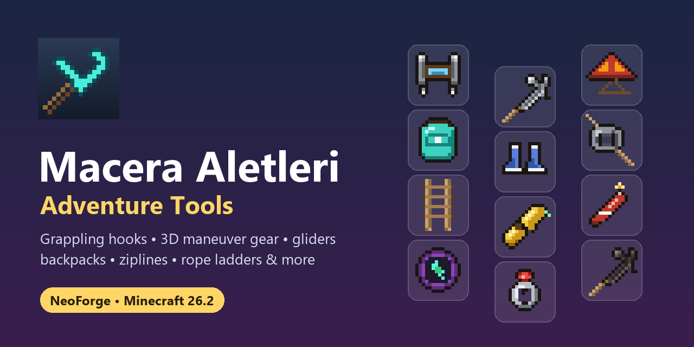

# Macera Aletleri

[English](README.md) | **Türkçe**

Keşfi ve hareketi eğlenceli hale getiren aletler ekleyen bir Minecraft modu: kancalar, Attack on Titan tarzı
3D manevra takımı, kamp ateşinin sıcak havasıyla yükselen planör, çift zıplama botları, sırtta taşınan çantalar,
ip merdiven, zipline, işaret fişeği, kaşif dürbünü ve daha fazlası.

| | |
|---|---|
| **Minecraft** | 26.2 |
| **Mod yükleyici** | NeoForge 26.2.0.88 veya üstü |
| **Mod sürümü** | 0.3.0 |
| **Gereken yer** | İstemci **ve** sunucu (çok oyunculuda iki tarafta da kurulu olmalı) |
| **Opsiyonel** | [Curios](https://modrinth.com/mod/curios): yüzük, eldiven ve planörü aksesuar slotlarına takmak için |
| **Lisans** | MIT |

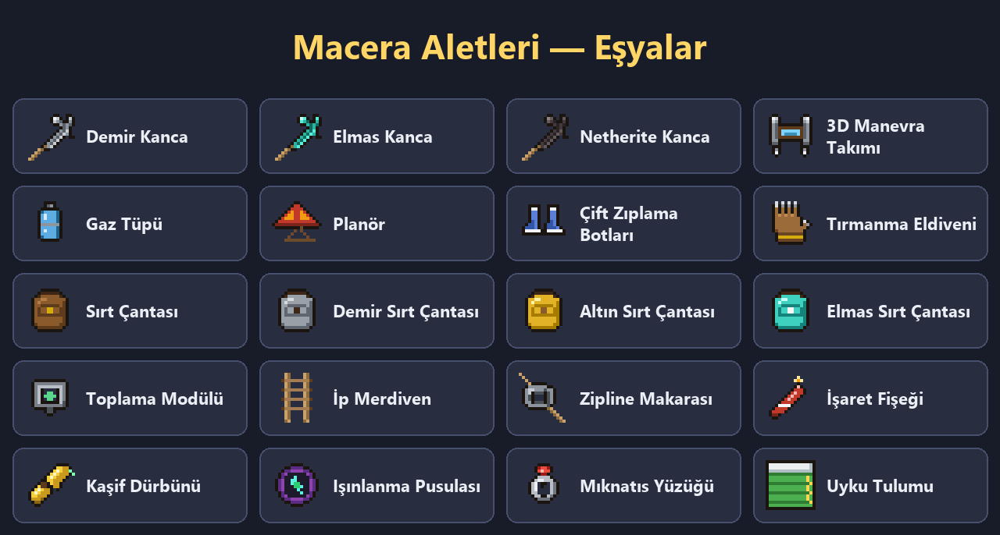

---

## İçindekiler

- [Kurulum](#kurulum)
- [Tuşlar](#tuşlar)
- [Aletler](#aletler)
- [Tarifler](#tarifler)
- [Büyüler, tamir ve dayanıklılık](#büyüler-tamir-ve-dayanıklılık)
- [Dünyada bulma](#dünyada-bulma)
- [Başarımlar](#başarımlar)
- [Ayarlar](#ayarlar)
- [Curios desteği](#curios-desteği)
- [Sık sorulan sorular](#sık-sorulan-sorular)
- [Geliştiriciler için](#geliştiriciler-için)

---

## Kurulum

### Resmî Minecraft Launcher ile

1. **NeoForge'u kurun**
   - [neoforged.net](https://neoforged.net) adresinden Minecraft **26.2** için NeoForge installer'ını indirin.
   - İndirilen `.jar` dosyasını çift tıklayarak açın, **Install client** seçili olsun, **OK**'a basın.
   - Minecraft Launcher'ı açın; sürüm listesinde **NeoForge** profili görünür.
   - Bu profille oyunu bir kez açıp kapatın, böylece `mods` klasörü oluşur.
2. **Modu kopyalayın**
   - `Win + R` → `%appdata%\.minecraft\mods` → **Enter**.
   - `maceraaletleri-0.3.0.jar` dosyasını bu klasöre kopyalayın.
3. **Oynayın:** Launcher'da **NeoForge** profilini seçip **Play**'e basın. Ana menüdeki **Mods** listesinde "Macera Aletleri" görünüyorsa kurulum tamamdır.

> NeoForge installer'ını çalıştırmak için bilgisayarınızda Java kurulu olmalıdır. Dosya açılmıyorsa [adoptium.net](https://adoptium.net) adresinden Java 25'i kurun.

### CurseForge App / Modrinth App / Prism Launcher ile

1. Yeni bir profil oluşturun: **Minecraft 26.2**, mod yükleyici **NeoForge**.
2. Modu uygulamada aratıp ekleyin ya da jar dosyasını profilin **mods** klasörüne kopyalayın.
3. Profili başlatın.

### Sunucuya kurulum

1. Sunucuya NeoForge 26.2 kurun (aynı installer, **Install server**).
2. Jar dosyasını sunucunun `mods` klasörüne kopyalayın.
3. Bağlanacak **her oyuncunun** da modu kurması gerekir.

---

## Tuşlar

| Tuş | Ne yapar |
|---|---|
| **M** | Mıknatıs yüzüğünü aç/kapat |
| **B** | Sırta takılı çantayı aç |

Tuşlar Seçenekler → Kontroller → **Macera Aletleri** bölümünden değiştirilebilir.

**İpucu:** Oyunda herhangi bir aletin üstüne gelip **Shift**'e basarsanız nasıl kullanıldığı yazar.
Oyuna ilk girişte envanterinize bir **Macera Rehberi** kitabı da gelir.

---

## Aletler

Hepsi kreatif menüde **Macera Aletleri** sekmesindedir.

### 🪝 Kanca (Demir / Elmas / Netherite)

| Ne yapmak istiyorsunuz | Nasıl |
|---|---|
| Kanca fırlatmak / geri çekmek | **Sağ tık** |
| Kendinizi çekmek | Kancayı bir **bloğa** atın |
| Sallanmak | Kanca bloğa takılıyken **Shift'i basılı tutun** |
| İpte yukarı tırmanmak / aşağı inmek | Sallanırken **Boşluk** / **S** |
| Mob veya eşya çekmek | Kancayı bir **moba** ya da yerdeki bir **eşyaya** atın |

Çekilirken düşme hasarı almazsınız.

| Kanca | Menzil | Çekme hızı | Dayanıklılık | Özel |
|---|---|---|---|---|
| **Demir** | 30 blok | Yavaş | 128 atış | – |
| **Elmas** | 45 blok | Orta | 512 atış | – |
| **Netherite** | 60 blok | Hızlı | 1024 atış | Lavda ve ateşte yanmaz |

### ⚔️ 3D Manevra Takımı

Attack on Titan'daki gibi iki kancalı hareket takımı. Ana elde tutulur:
- **Sol tık:** sol kanca. **Sağ tık:** sağ kanca. Aynı tuşa tekrar basmak o kancayı geri çeker.
- Takılı kancalar sizi kendilerine doğru **hızlandırır**. İki kanca birlikte kullanılınca aralarından savrulursunuz.
- **Boşluk:** baktığınız yöne gaz püskürterek hızlanırsınız.
- Kancalar ve itki **gaz** harcar. Kalan gaz eşyanın altındaki mavi çubukta görünür (depo: 1000).
- Gaz bitince envanterdeki **Gaz Tüpü** otomatik takılır.

### 🪂 Planör

Elinizde tutarken **düşmeye başladığınızda** açılır ve baktığınız yöne süzülürsünüz.
- Açıkken başınızın üstünde görünür (diğer oyuncular da görür).
- **Yanan bir kamp ateşinin** (ya da ateşin) üstünden geçerken sıcak hava sizi **yukarı kaldırır**.
- **Shift**'e basınca kapanır. Süzülürken düşme hasarı almazsınız.

### 👢 Çift Zıplama Botları

Ayağa giyilir. Havadayken zıplama tuşuna **tekrar basınca** bir kez daha zıplarsınız. Düşme hasarı da **yarıya** iner.

### 🎒 Sırt Çantaları

| Çanta | Slot | Nasıl yapılır |
|---|---|---|
| Sırt Çantası | 27 | Tarif |
| Demir Sırt Çantası | 36 | Sırt çantası + demir blok |
| Altın Sırt Çantası | 45 | Demir çanta + altın blok |
| Elmas Sırt Çantası | 54 | Altın çanta + elmas blok |

- **Sağ tık:** açar. **Shift + sağ tık:** sırta (göğüs slotuna) takar. Sırttayken sırtınızda görünür ve **B** ile açılır.
- İçindekiler çantayla taşınır ve yükseltirken korunur.
- **Toplama Modülü:** Envanterde modülü çantanın üstüne bırakın. Artık çantada zaten bulunan türden eşyalar yerden alınınca doğrudan çantaya gider.
- Çantanın içine başka bir sırt çantası konamaz.

### 🪜 İp Merdiven

Bir duvarın yan yüzüne ya da **uçurum kenarındaki bloğun üstüne** sağ tıklayın. Merdiven aşağı doğru yere değene kadar (en fazla 24 blok) kendiliğinden açılır.
Herhangi bir parçasını kırmak ya da **Shift + sağ tık**, bütün merdiveni toplar ve 1 ip merdiven geri verir.

### 🚡 Zipline Makarası

1. Makarayla bir bloğa **sağ tıklayın**: başlangıç noktası seçilir.
2. Başka bir bloğa **sağ tıklayın**: hat kurulur (en fazla 48 blok).
3. Hattın **herhangi bir ucuna sağ tıklayın**: öbür uca kayarsınız.

Uca **vurursanız** hat kopar ve makara geri düşer.

### 🔥 İşaret Fişeği

**Sağ tık** ile fırlatılır. Düştüğü yerde **1 dakika** boyunca etrafı aydınlatır ve uzaktan görünen **kırmızı duman** çıkarır.

### 🧲 Mıknatıs Yüzüğü

Envanterde dururken, **açıksa** yakındaki eşyaları ve deneyim kürelerini çeker (8 blok).
Açmak/kapatmak: elde **sağ tık** ya da **M**. **Shift** basılıyken çekmez.

### 🧭 Işınlanma Pusulası

**Shift + sağ tık:** konumu kaydeder. **Sağ tık:** oraya ışınlar (30 sn bekleme süresi).

### 🔭 Kaşif Dürbünü

**Sağ tık:** Yakındaki (12 blok) cevherler **10 saniye boyunca duvarların arkasından**, her biri kendi renginde parlar.

### 🧤 Tırmanma Eldiveni

Elde tutarken duvara doğru **yürüyün**: tırmanırsınız. **Shift:** tutunursunuz. Hiçbir tuş: yavaşça kayarsınız.

### 🛏️ Uyku Tulumu

Yere koyun, geceleri **sağ tıklayıp** uyuyun. Gece atlanır ama **doğma noktanız değişmez**.

### 💀 Ölüm Pusulası

Öldüğünüzde, yeniden doğunca envanterinize kendiliğinden gelir. İğnesi eşyalarınızı bıraktığınız yeri gösterir.
Elinizdeyken kalan mesafeyi yazar; oraya varınca kaybolur. (`keepInventory` açıksa verilmez.)

---

## Tarifler

Tüm tarifler oyundaki **tarif kitabında** görünür (ilgili malzemeyi aldığınızda açılır). JEI veya EMI kuruluysa orada da görünürler.

| Alet | Tarif |
|---|---|
| **Demir Kanca** | 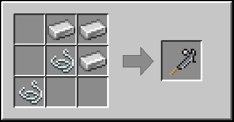 |
| **Elmas Kanca** | 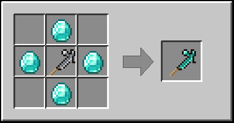 |
| **Netherite Kanca** (demirci masası) | 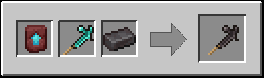 |
| **3D Manevra Takımı** | 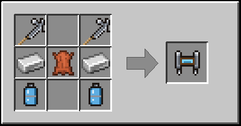 |
| **Gaz Tüpü** (×2) | 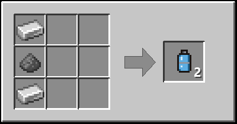 |
| **Planör** | 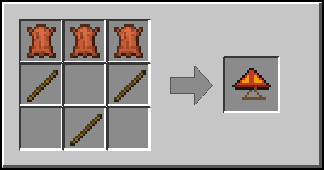 |
| **Çift Zıplama Botları** | 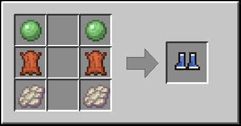 |
| **Tırmanma Eldiveni** | 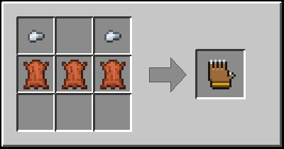 |
| **Sırt Çantası** | 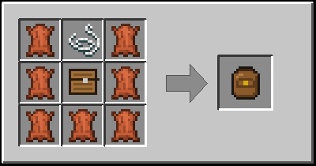 |
| **Demir Sırt Çantası** | 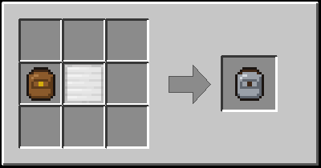 |
| **Altın Sırt Çantası** | 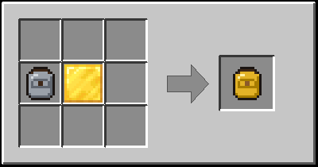 |
| **Elmas Sırt Çantası** | 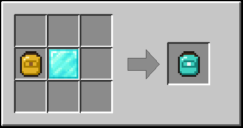 |
| **Toplama Modülü** | 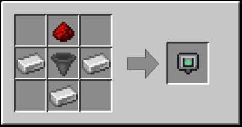 |
| **İp Merdiven** | 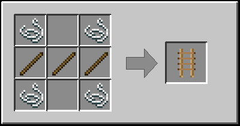 |
| **Zipline Makarası** | 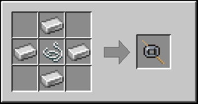 |
| **İşaret Fişeği** (×4) | 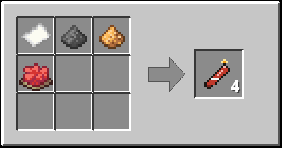 |
| **Kaşif Dürbünü** | 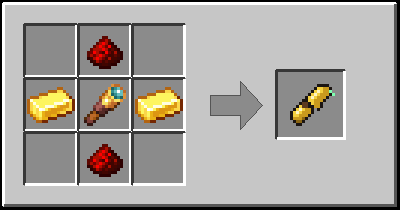 |
| **Işınlanma Pusulası** | 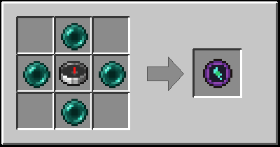 |
| **Mıknatıs Yüzüğü** | 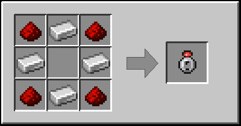 |
| **Uyku Tulumu** (herhangi renk yün) | 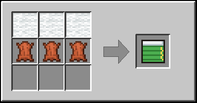 |

Sırt çantası tarifinde herhangi bir tahta sandık kullanılabilir; çanta yükseltmeleri şekilsizdir.

---

## Büyüler, tamir ve dayanıklılık

### Modun büyüleri

Büyü masasında, kitaplardan ve köylü takaslarından çıkar:

| Büyü | Hangi alete | Etkisi |
|---|---|---|
| **Menzil** I–III | Kancalar | Seviye başına %20 daha uzun ip |
| **Hızlı Çekim** I–III | Kancalar | Seviye başına %15 daha hızlı çekme |
| **Süzülme** I–II | Planör | Daha yavaş düşüş, daha hızlı süzülme |
| **Çekim Gücü** I–III | Mıknatıs Yüzüğü | Seviye başına +3 blok çekim yarıçapı |

Dayanıklılığı olan aletlere **Kırılmazlık** ve **Tamir**, botlara **Tüy Gibi Düşüş** gibi zırh büyüleri de uygulanabilir.

### Örste tamir

| Alet | Tamir malzemesi |
|---|---|
| Demir / Elmas / Netherite Kanca | Demir külçe / elmas / netherite külçe |
| Planör | Deri |
| Çift Zıplama Botları | Fantom zarı |
| Işınlanma Pusulası | Ender incisi |
| Kaşif Dürbünü | Altın külçe |

---

## Dünyada bulma

- **Yapı sandıkları:** Zindan, maden, çöl ve orman tapınakları, yıkık portal, gemi enkazı, yağmacı karakolu, orman konağı, kale, antik şehir, iglu ve gömülü hazine sandıklarından modun aletleri çıkabilir.
- **Gezgin tüccar:** Zümrüt karşılığında kanca, planör, ip merdiven, işaret fişeği, uyku tulumu, çift zıplama botları ve gaz tüpü satabilir.

---

## Başarımlar

Başarımlar ekranında (**L** tuşu) **Macera Aletleri** sekmesi:

| Başarım | Nasıl alınır |
|---|---|
| Tutun! | Bir kanca edin |
| Lav Geçirmez | Netherite kanca edin |
| Tarzan | Kancayla 15 saniye kesintisiz sallan |
| Gel Buraya! | Bir canlıyı kancayla yanına çek |
| Titan Avcısı | 3D manevra takımının iki kancasını aynı anda tak |
| Kuş Gibi | Planörle 10 saniye süzül |
| Sıcak Hava | Kamp ateşinin sıcak havasıyla planörle yüksel |
| Yerçekimi Kim? | Havadayken bir kez daha zıpla |
| Wiii! | Bir zipline'ın sonuna kadar kay |
| Hazine Avcısı | Kaşif dürbünüyle elmas bul |

---

## Ayarlar

Sunucu sahipleri değerleri değiştirebilir:
- **Oyun içinden:** Mods → Macera Aletleri → **Config**
- **Dosyadan:** Dünya klasöründe `serverconfig/maceraaletleri-server.toml`

| Ayar | Varsayılan |
|---|---|
| Kanca menzil / çekme hızı çarpanı | 1.0 / 1.0 |
| Kanca mob ve eşya çekebilsin mi | Evet |
| Planör en fazla düşme hızı / ileri hız | 0.08 / 0.4 |
| 3D manevra çekme ivmesi / kanca başına gaz tüketimi | 0.09 / 1 |
| Mıknatıs yarıçapı | 8 blok |
| Pusula bekleme süresi / boyutlar arası ışınlanma | 30 sn / Evet |
| Dürbün arama yarıçapı / parlama süresi | 12 blok / 10 sn |
| Zipline en fazla uzunluk | 48 blok |
| Ölüm pusulası ver / ilk girişte rehber kitap ver | Evet / Evet |

Ayarlar sunucudan oyunculara otomatik gönderilir.

---

## Curios desteği

[Curios](https://modrinth.com/mod/curios) modu da kuruluysa:
- **Mıknatıs Yüzüğü** → yüzük slotu (M tuşuyla açılıp kapanır)
- **Tırmanma Eldiveni** → el slotu
- **Planör** → sırt slotu

Aksesuar slotundaki aletler elde tutuluyormuş gibi çalışır. Curios kurulu değilse mod yine sorunsuz çalışır.

---

## Sık sorulan sorular

**Mod listede görünmüyor.**
Oyunu NeoForge profiliyle açtığınızdan ve Minecraft sürümünün **26.2** olduğundan emin olun. Jar dosyası `mods` klasörünün içinde olmalı, alt klasörde değil.

**"Mod requires NeoForge ..." hatası.**
NeoForge sürümünüz eski; 26.2.0.88 veya daha yenisini kurun.

**Sunucuya bağlanamıyorum, "mismatched mod list" diyor.**
Mod hem sunucuda hem sizde, aynı sürümde kurulu olmalı.

**3D manevra takımı kanca atmıyor.**
Takım **ana elde** olmalı. Gaz bittiyse envanterinize gaz tüpü koyun.

**Planör açılmıyor.**
Sadece **düşerken** açılır (kamp ateşi üstündeyse yükselirken de). Shift'e basıyorsanız kapalı kalır. Elytra ile birlikte çalışmaz.

**B tuşu çantayı açmıyor.**
B sadece **sırta takılı** çantayı açar. Çantayı elinize alıp **Shift + sağ tık** yapın.

**Mıknatıs bazı eşyaları çekmiyor.**
Kendi attığınız eşyalar kısa bir süre çekilmez, yoksa attığınız anda geri gelirlerdi.

**Hata bildirmek istiyorum.**
`logs\latest.log` dosyasını ve sorunu nasıl oluşturduğunuzu ekleyerek bir issue açın.

---

## Geliştiriciler için

### Gereksinimler

- **JDK 25.** Gradle eksikse otomatik indirmeyi dener. Başarısız olursa JDK 25'i kurup yolunu `~/.gradle/gradle.properties` dosyasına `org.gradle.java.installations.paths=...` olarak ekleyin.
- **En az 8 GB boş bellek.** İlk derlemede Minecraft kaynak kodu decompile edilir (yaklaşık 7 GB RAM). Sonraki derlemelerde bu adım atlanır.
- IDE olarak **IntelliJ IDEA** önerilir; *File → Open* ile proje klasörünü açın ve Gradle JVM olarak JDK 25 seçin.

### Komutlar

| Komut | Ne yapar |
|---|---|
| `./gradlew build` | Modu derler: `build/libs/maceraaletleri-<sürüm>.jar` |
| `./gradlew runClient` | Modla (ve test için Curios ile) Minecraft'ı açar; hesap gerekmez |
| `./gradlew runServer` | Test sunucusu açar |
| `./gradlew runGameTestServer` | Pencere açmadan sunucuyu başlatır, veri dosyalarını yükler ve kapanır. JSON hatalarını yakalamak için kullanışlı. |

### Proje yapısı

```
src/main/java/com/ismail/maceraaletleri/
├── MaceraAletleri.java         Giriş noktası, kayıtlar
├── Ayarlar.java                Sunucu ayarları (config)
├── Basarimlar.java             Koddan verilen başarımlar
├── Buyuler.java                Modun büyüleri (etkileri kodda okunur)
├── ModItems / ModBlocks / ModEntities / ModMenus / ModDataComponents / ModCreativeTabs
├── item/                       Aletlerin eşya sınıfları
├── block/                      İp merdiven, uyku tulumu
├── entity/                     Kanca, zipline, işaret fişeği
├── menu/                       Sırt çantası menüsü
├── event/                      Planör, eldiven, mıknatıs, botlar, sunucu olayları
├── network/                    İstemci → sunucu paketleri
├── compat/                     Curios entegrasyonu (opsiyonel)
└── client/                     Renderer'lar, oyuncu katmanı, çanta ekranı, tuşlar, ipuçları

src/main/resources/
├── assets/maceraaletleri/      Modeller, dokular, dil dosyaları (tr_tr, en_us)
├── data/maceraaletleri/        Tarifler, başarımlar, büyüler, ganimet, takaslar, tag'ler
├── data/minecraft/             Vanilla tag eklemeleri
├── data/curios/                Curios slot etiketleri
└── META-INF/accesstransformer.cfg
```

### Yeni sürüm yayınlama

1. `gradle.properties` içindeki `mod_version` değerini artırın.
2. `./gradlew build` çalıştırın.
3. `build/libs/` içindeki jar dosyasını yükleyin.
4. [CHANGELOG.md](CHANGELOG.md) dosyasına yeni sürümü ekleyin.

---

## Lisans

[MIT](LICENSE) © 2026 M. Ege
